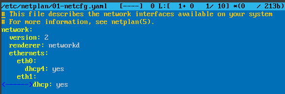
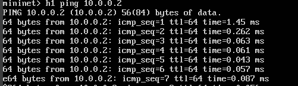

---
# Front matter
# Front matter
lang: ru-RU
title: "Моделирование сетей передачи данных"
subtitle: "Лабораторная работа №1: Введение в Mininet"
author: "Ахлиддинзода Аслиддин"
institute:
  - Российский университет дружбы народов, Москва, Россия

# i18n babel
babel-lang: russian
babel-otherlangs: english

# Formatting pdf
toc: false
toc-title: Содержание
slide_level: 2
aspectratio: 169
section-titles: true
theme: metropolis
header-includes:
 - \metroset{progressbar=frametitle,sectionpage=progressbar,numbering=fraction}
 - '\makeatletter'
 - '\beamer@ignorenonframefalse'
 - '\makeatother'
---
# Цель работы

Основной целью работы является развёртывание в системе виртуализации
(например, в VirtualBox) mininet, знакомство с основными командами для работы с Mininet через командную строку и через графический интерфейс.

# Выполнение лабораторной работы

1. Добавим для mininet указание на использование двух адаптеров при запуске.

2. Проверим номер установленной версии mininet.

3. Здесь выбираем системный моноширинный шрифт, кегль шрифта — 12 пунктов.

4. Проверим подключение между хостами h1 и h2 с помощью команды ping.

# Вывод

В ходе выполнения лабораторной работы получили навыки развертывания в системе виртуализации
(например, в VirtualBox) mininet, познакомились с основными командами для работы с Mininet через командную строку и через графический интерфейс.

# Список литературы. Библиография

[1] Mininet: https://mininet.org/