---
## Front matter
title: "Моделирование сетей передачи данных"
subtitle: "Отчёт по лабораторной работе №3: Измерение и тестирование пропускной способности сети. Воспроизводимый эксперимент"
author: "Ахлиддинзода Аслиддин"

## Generic otions
lang: ru-RU
toc-title: "Содержание"

## Bibliography
bibliography: bib/cite.bib
csl: pandoc/csl/gost-r-7-0-5-2008-numeric.csl

## Pdf output format
toc: true # Table of contents
toc-depth: 2
lof: true # List of figures
lot: true # List of tables
fontsize: 12pt
linestretch: 1.5
papersize: a4
documentclass: scrreprt
## I18n polyglossia
polyglossia-lang:
  name: russian
  options:
  - spelling=modern
  - babelshorthands=true
polyglossia-otherlangs:
  name: english
## I18n babel
babel-lang: russian
babel-otherlangs: english
## Fonts
mainfont: PT Serif
romanfont: PT Serif
sansfont: PT Sans
monofont: PT Mono
mainfontoptions: Ligatures=TeX
romanfontoptions: Ligatures=TeX
sansfontoptions: Ligatures=TeX,Scale=MatchLowercase
monofontoptions: Scale=MatchLowercase,Scale=0.9
## Biblatex
biblatex: true
biblio-style: "gost-numeric"
biblatexoptions:
  - parentracker=true
  - backend=biber
  - hyperref=auto
  - language=auto
  - autolang=other*
  - citestyle=gost-numeric
## Pandoc-crossref LaTeX customization
figureTitle: "Рис."
tableTitle: "Таблица"
listingTitle: "Листинг"
lolTitle: "Листинги"
## Misc options
indent: true
header-includes:
  - \usepackage{indentfirst}
  - \usepackage{float} # keep figures where there are in the text
  - \floatplacement{figure}{H} # keep figures where there are in the text
---
# Цель работы

Основной целью работы является знакомство с инструментом для измерения пропускной способности сети в режиме реального времени — iPerf3, а также получение навыков проведения воспроизводимого эксперимента по измерению пропускной способности моделируемой сети в среде Mininet.

# Выполнение лабораторной работы

1. Запустили скрипт lab_iperf3_topo.py:

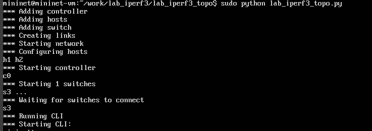

2. Посмотрели элементы топологии и завершили работу mininet:

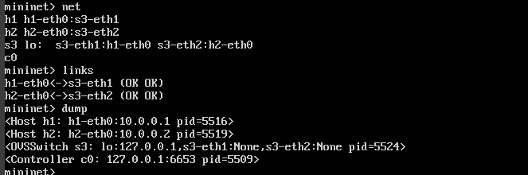

3. Следующим шагом внесём в скрипт lab_iperf3_topo.py изменение, позволяющее вывести на экран  информацию о хосте h1, а именно имя хоста, его IP-адрес, MAC-адрес. Для этого после строки, задающей старт работы сети, добавим нужную строку:

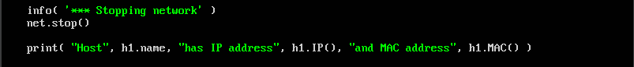

4. Запускаем скрипт с нашими изминениями:

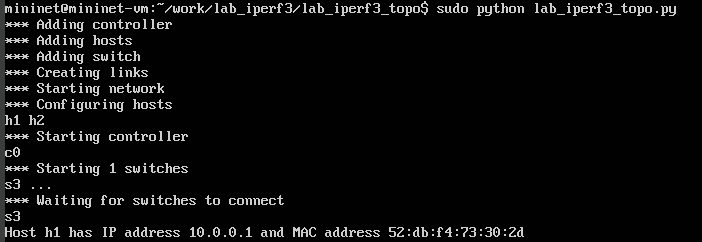

5. Затем изменим скрипт lab_iperf3_topo.py так, чтобы на экран выводилась информация об имени, IP-адресе и MAC-адресе обоих хостов сети и проверим корректность отработки изменённого скрипта:

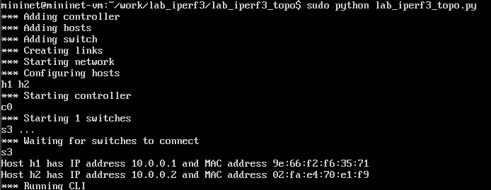

6. В начале скрипта lab_iperf3_topo2.py добавим записи об импорте классов CPULimitedHost и TCLink.  Далее изменим строку описания сети, указав на использование ограничения производительности и изоляции. Следующим шагом изменим функцию задания параметров виртуального хоста h1, указав, что ему будет выделено 50% от общих ресурсов процессора системы. Аналогичным образом для хоста h2 зададим долю выделения ресурсов процессора в 45%. В конце изменим функцию параметров соединения между хостом h1 и коммутатором s3:

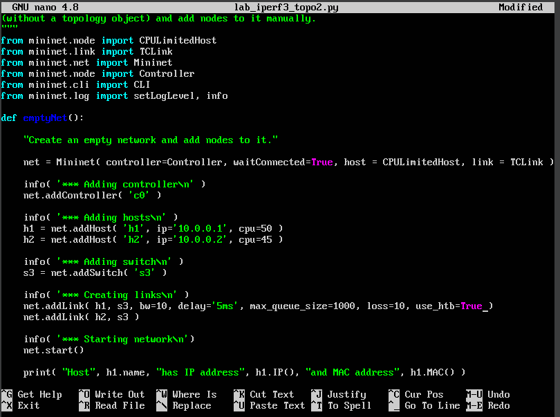

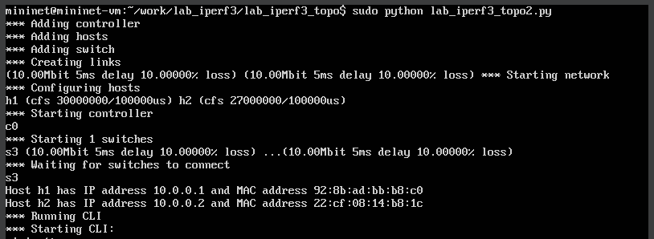

7. Сделали копию скрипта lab_iperf3_topo2.py и поместили его в подкаталог iperf:

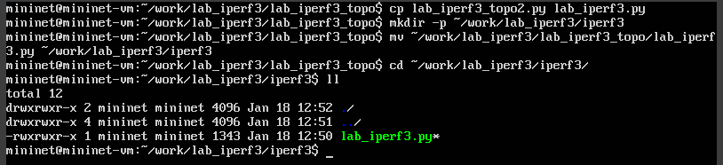

8. Изменили код в скрипте lab_iperf3.py так, чтобы: на хостах не было ограничения по использованию ресурсов процессора и
 каналы между хостами и коммутатором были по 100 Мбит/с с задержкой 75 мс, без потерь, без использования ограничителей пропускной
способности и максимального размера очереди.:

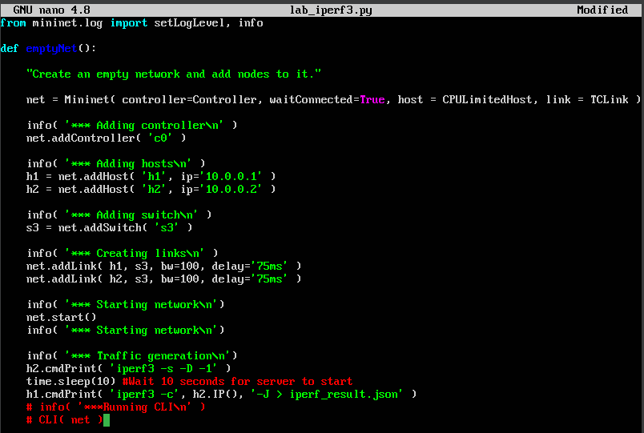

9. Запускаем скрипт на отработку (рис. [-@fig:010]):

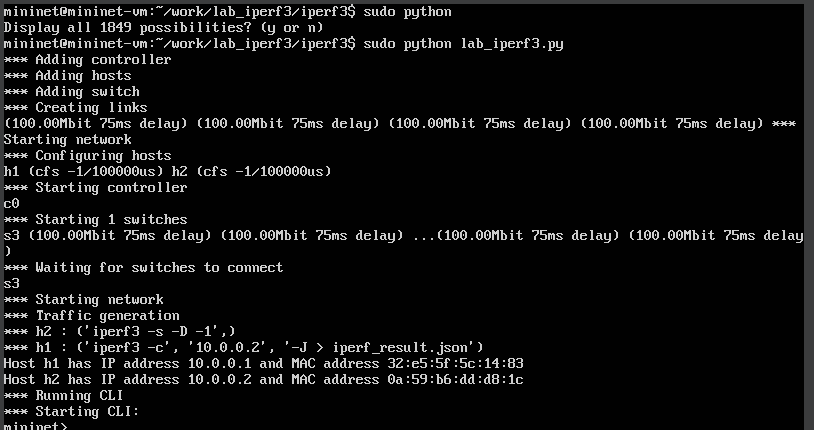

10. Создаем Makefile:

11. Запускаем его:

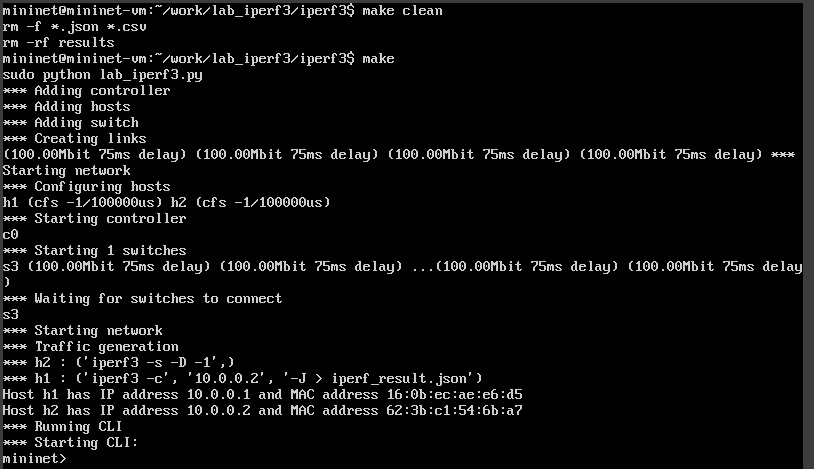

# Вывод

В ходе выполнения лабораторной работы познакомились с инструментом для измерения пропускной способности 
сети в режиме реального времени — iPerf3, а также получили навыки проведения воспроизводимого 
эксперимента по измерению пропускной способности моделируемой сети в среде Mininet

# Список литературы. Библиография

[1] Mininet: https://mininet.org/
