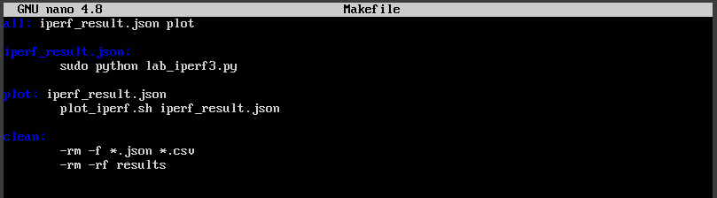

---
# Front matter
# Front matter
lang: ru-RU
title: "Моделирование сетей передачи данных"
subtitle: "Отчёт по лабораторной работе №3: Измерение и тестирование пропускной способности сети. Воспроизводимый эксперимент"
author: "Ахлиддинзода Аслиддин"
institute:
  - Российский университет дружбы народов, Москва, Россия

# i18n babel
babel-lang: russian
babel-otherlangs: english

# Formatting pdf
toc: false
toc-title: Содержание
slide_level: 2
aspectratio: 169
section-titles: true
theme: metropolis
header-includes:
 - \metroset{progressbar=frametitle,sectionpage=progressbar,numbering=fraction}
 - '\makeatletter'
 - '\beamer@ignorenonframefalse'
 - '\makeatother'
---
# Цель работы

Основной целью работы является знакомство с инструментом для измерения пропускной способности сети в режиме реального времени — iPerf3, а также получение навыков проведения воспроизводимого эксперимента по измерению пропускной способности моделируемой сети в среде Mininet.

# Выполнение лабораторной работы

1. Запустили скрипт lab_iperf3_topo.py:

2. Посмотрели элементы топологии и завершили работу mininet:

3. Следующим шагом внесём в скрипт lab_iperf3_topo.py изменение, позволяющее вывести на экран  информацию о хосте h1, а именно имя хоста, его IP-адрес, MAC-адрес. Для этого после строки, задающей старт работы сети, добавим нужную строку:

4. Запускаем скрипт с нашими изминениями:

5. Затем изменим скрипт lab_iperf3_topo.py так, чтобы на экран выводилась информация об имени, IP-адресе и MAC-адресе обоих хостов сети и проверим корректность отработки изменённого скрипта:

6. В начале скрипта lab_iperf3_topo2.py добавим записи об импорте классов CPULimitedHost и TCLink.  Далее изменим строку описания сети, указав на использование ограничения производительности и изоляции. Следующим шагом изменим функцию задания параметров виртуального хоста h1, указав, что ему будет выделено 50% от общих ресурсов процессора системы. Аналогичным образом для хоста h2 зададим долю выделения ресурсов процессора в 45%. В конце изменим функцию параметров соединения между хостом h1 и коммутатором s3:

7. Сделали копию скрипта lab_iperf3_topo2.py и поместили его в подкаталог iperf:

8. Изменили код в скрипте lab_iperf3.py так, чтобы: на хостах не было ограничения по использованию ресурсов процессора и
 каналы между хостами и коммутатором были по 100 Мбит/с с задержкой 75 мс, без потерь, без использования ограничителей пропускной
способности и максимального размера очереди.:

9. Запускаем скрипт на отработку (рис. [-@fig:010]):

10. Создаем Makefile:

11. Запускаем его:

# Вывод

В ходе выполнения лабораторной работы познакомились с инструментом для измерения пропускной способности 
сети в режиме реального времени — iPerf3, а также получили навыки проведения воспроизводимого 
эксперимента по измерению пропускной способности моделируемой сети в среде Mininet

# Список литературы. Библиография

[1] Mininet: https://mininet.org/
