---
## Front matter
title: "Моделирование сетей передачи данных"
subtitle: "Отчёт по лабораторной работе №4: Эмуляция и измерение задержек в глобальных сетях"
author: "Ахлиддинзода Аслиддин"

## Generic otions
lang: ru-RU
toc-title: "Содержание"

## Bibliography
bibliography: bib/cite.bib
csl: pandoc/csl/gost-r-7-0-5-2008-numeric.csl

## Pdf output format
toc: true # Table of contents
toc-depth: 2
lof: true # List of figures
lot: true # List of tables
fontsize: 12pt
linestretch: 1.5
papersize: a4
documentclass: scrreprt
## I18n polyglossia
polyglossia-lang:
  name: russian
  options:
  - spelling=modern
  - babelshorthands=true
polyglossia-otherlangs:
  name: english
## I18n babel
babel-lang: russian
babel-otherlangs: english
## Fonts
mainfont: PT Serif
romanfont: PT Serif
sansfont: PT Sans
monofont: PT Mono
mainfontoptions: Ligatures=TeX
romanfontoptions: Ligatures=TeX
sansfontoptions: Ligatures=TeX,Scale=MatchLowercase
monofontoptions: Scale=MatchLowercase,Scale=0.9
## Biblatex
biblatex: true
biblio-style: "gost-numeric"
biblatexoptions:
  - parentracker=true
  - backend=biber
  - hyperref=auto
  - language=auto
  - autolang=other*
  - citestyle=gost-numeric
## Pandoc-crossref LaTeX customization
figureTitle: "Рис."
tableTitle: "Таблица"
listingTitle: "Листинг"
lolTitle: "Листинги"
## Misc options
indent: true
header-includes:
  - \usepackage{indentfirst}
  - \usepackage{float} # keep figures where there are in the text
  - \floatplacement{figure}{H} # keep figures where there are in the text
---
# Цель работы

Основной целью работы является знакомство с NETEM — инструментом для тестирования 
производительности приложений в виртуальной сети, а также получение навыков проведения 
интерактивного и воспроизводимого экспериментов по измерению задержки и её дрожания (jitter) 
в моделируемой сети в среде Mininet.

# Выполнение лабораторной работы

1. На хостах h1 и h2 введём команду ifconfig, чтобы отобразить информацию, относящуюся к их сетевым 
интерфейсам и назначенным им IP-адресам. В дальнейшем при работе с NETEM и командой tc 
будут использоваться интерфейсы h1-eth0 и h2-eth0 (рис. [-@fig:003]):

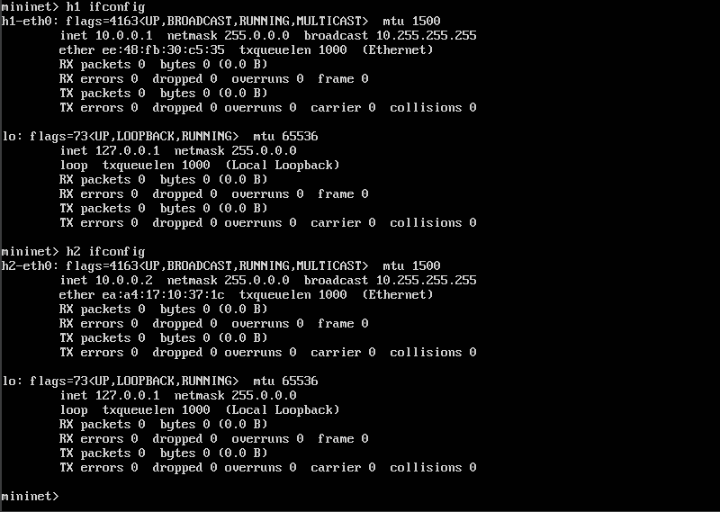

2. Проверим подключение между хостами h1 и h2 с помощью команды ping с параметром -c 6:

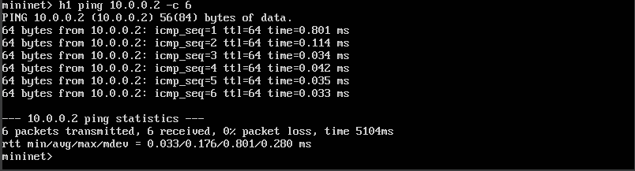

3. Проверим, что соединение от хоста h1 к хосту h2 имеет задержку 100 мс, используя команду ping 
с параметром -c 6 с хоста h1:

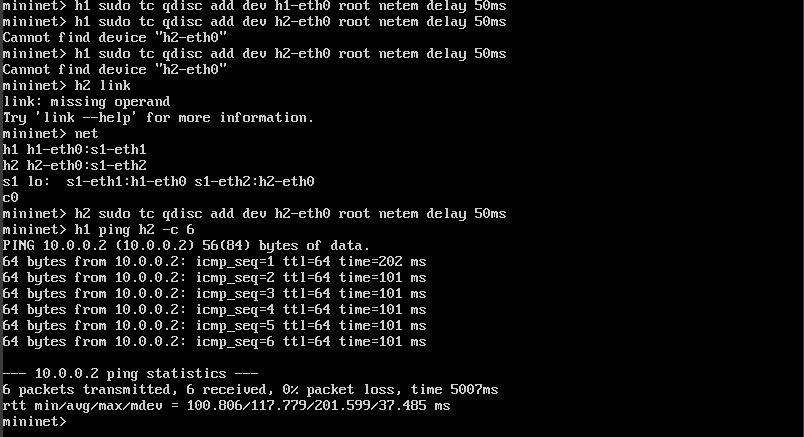

4. Восстановим конфигурацию по умолчанию, удалив все правила, применённые к сетевому планировщику 
соответствующего интерфейса:

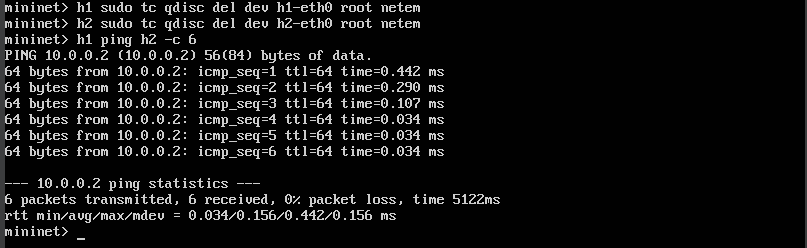

5. Добавим на узле h1 задержку в 100 мс со случайным отклонением 10 мс:

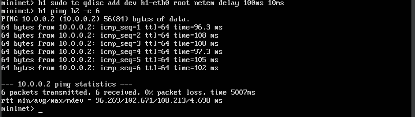

6. Добавим на интерфейсе хоста h1 задержку в 100 мс с вариацией ±10 мс и значением корреляции в 25%. 
Убедимся, что все пакеты, покидающие устройство h1 на интерфейсе h1- eth0, будут иметь 
время задержки 100 мс со случайным отклонением ±10 мс, при этом время передачи следующего 
пакета зависит от предыдущего значения на 25%. Используем для этого в терминале хоста h1 команду ping
с параметром -c 20:

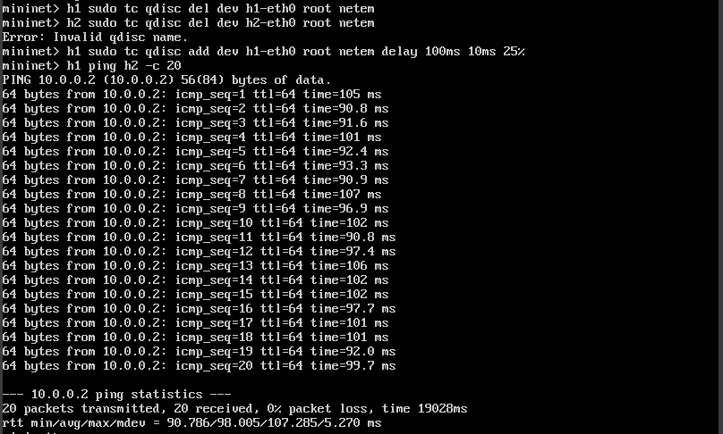

7. Убедимся, что все пакеты, покидающие хост h1 на интерфейсе h1-eth0, будут иметь время задержки, 
которое распределено в диапазоне 100 мс ±20 мс. Используем для этого команду ping на терминале хоста h1 с параметром 
-c 10:

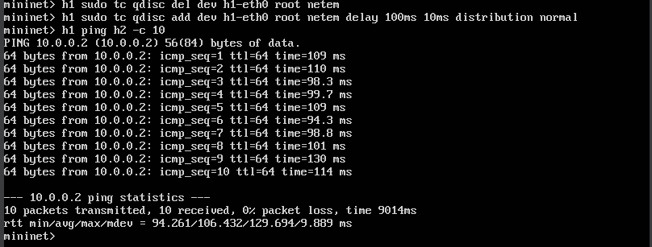

8. Создадим скрипт для эксперимента lab_netem_i.py:

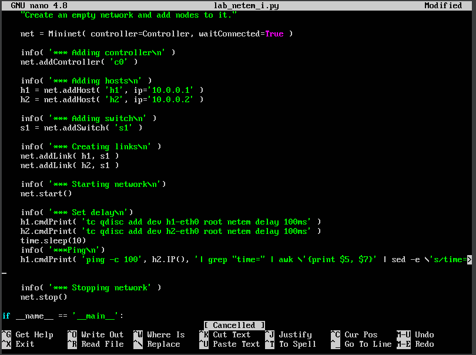

9. Создадим файл ping_plot:

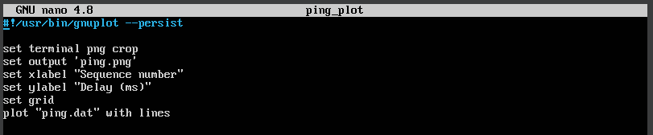

10. Создадим файла Makefile:

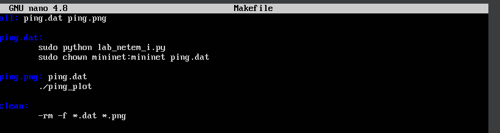

11. Выполним эксперимент:

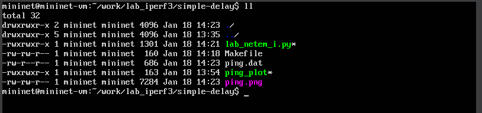

12. Просмотрим построенный в результате выполнения скриптов график:

13. Просмотрим заново построенный график:

# Вывод

В ходе выполнения лабораторной работы познакомились с NETEM — инструментом для тестирования 
производительности приложений в виртуальной сети, а также получили навыки проведения 
интерактивного и воспроизводимого экспериментов по измерению задержки и её дрожания (jitter) 
в моделируемой сети в среде Mininet.

# Список литературы. Библиография

[1] Mininet: https://mininet.org/