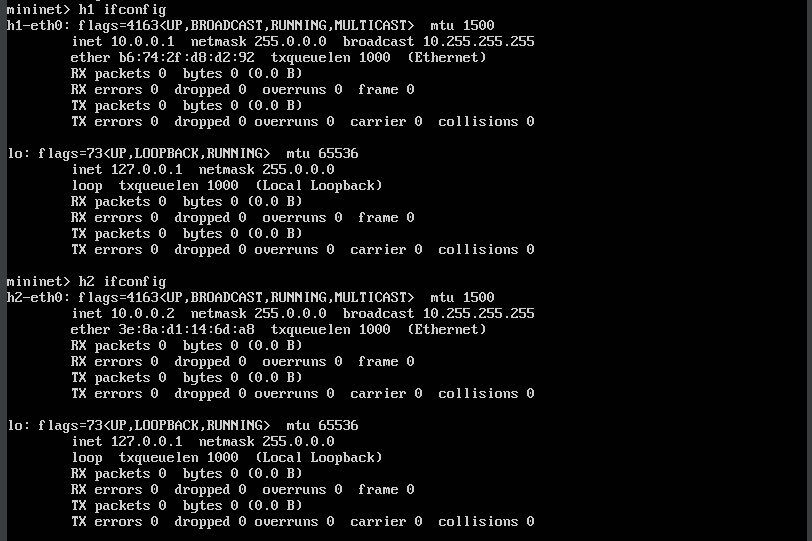
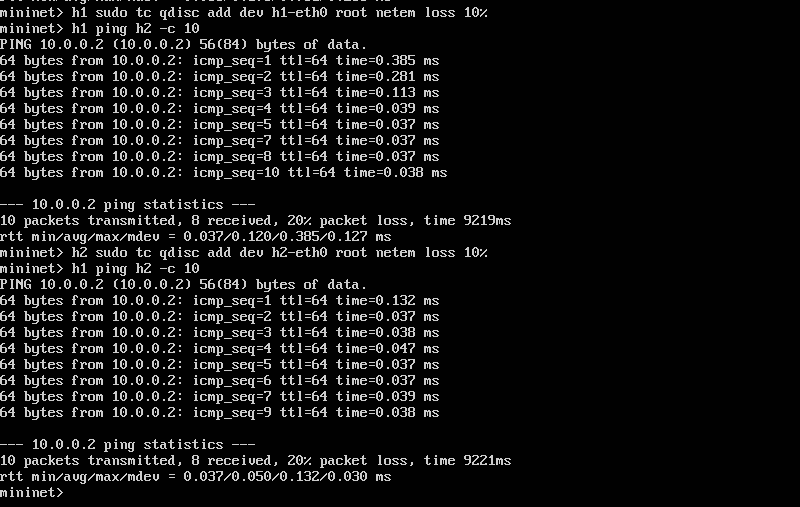
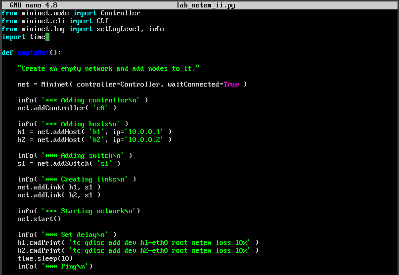
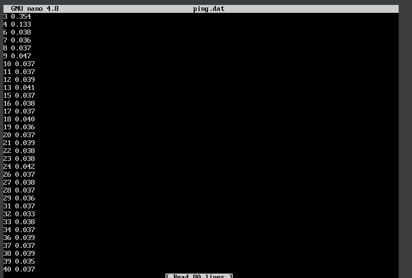
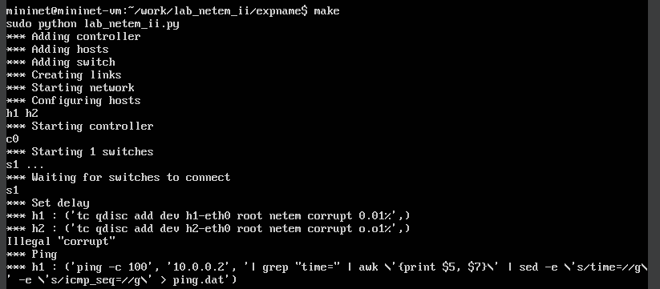
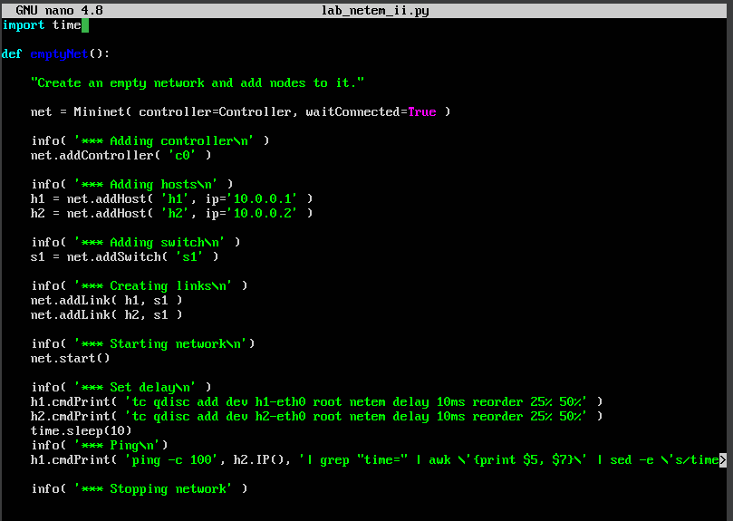
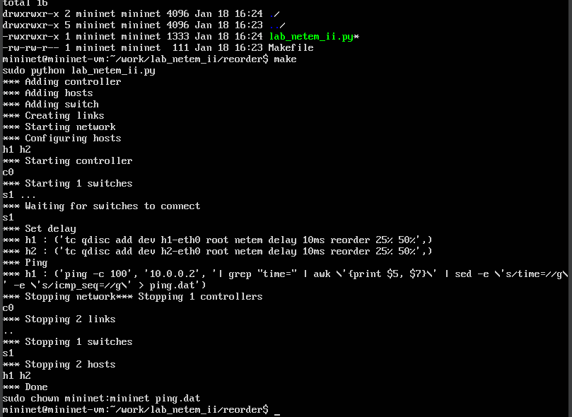

---
# Front matter
# Front matter
lang: ru-RU
title: "Моделирование сетей передачи данных"
subtitle: "Лабораторная работа №5: Эмуляция и измерение потерь пакетов в глобальных сетях"
author: "Ахлиддинзода Аслиддин"
institute:
  - Российский университет дружбы народов, Москва, Россия

# i18n babel
babel-lang: russian
babel-otherlangs: english

# Formatting pdf
toc: false
toc-title: Содержание
slide_level: 2
aspectratio: 169
section-titles: true
theme: metropolis
header-includes:
 - \metroset{progressbar=frametitle,sectionpage=progressbar,numbering=fraction}
 - '\makeatletter'
 - '\beamer@ignorenonframefalse'
 - '\makeatother'
---

# Цель работы

Основной целью работы является получение навыков проведения интерактивных экспериментов в среде Mininet по исследованию параметров сети, связанных с потерей, дублированием, изменением порядка и повреждением пакетов при передаче данных. Эти параметры влияют на производительность протоколов и сетей.

# Выполнение лабораторной работы

1. На хостах h1 и h2 введём команду ifconfig, чтобы отобразить информацию, относящуюся к их сетевым интерфейсам и назначенным им IP-адресам. В дальнейшем при работе с NETEM и командой tc будут использоваться интерфейсы h1-eth0 и h2-eth0:

2. Проверим подключение между хостами h1 и h2 с помощью команды ping с параметром -c 6:

3.  Проверим, что соединение между хостом h1 и хостом h2 имеет больший процент потерянных данных (10% от хоста h1 к хосту h2 и 10% от хоста h2 к хосту h1), повторив команду ping с параметром -c 100 на терминале хоста h1:

4. Добавим на интерфейсе узла h1 коэффициент потери пакетов 50% (такой высокий уровень потери пакетов маловероятен), и каждая последующая вероятность зависит на 50% от последней:

5. Проверим, что на соединении от хоста h1 к хосту h2 имеются потери пакетов, используя команду ping с параметром -c 20 с хоста h1. Убедимся, что часть пакетов не будут иметь задержки (один из четырех, или 25%), а последующие несколько пакетов будут иметь задержку около 10 миллисекунд (трииз четырех, или 75%):

6. Проверим, что соединение от хоста h1 к хосту h2 имеются дубликаты пакетов :

{ #fig:006 width=100% height=100% }

7. Создадим скрипт для эксперимента lab_netem_ii.py с потерей 10%:

8. Открываем ping.dat и смотрим результаты:

9. Создаем Makefile как из прошлой лабораторной работы и запускаем:

10. Создадим скрипт для эксперимента lab_netem_ii.py с переотправкой:

11. Создаем для этого скрипта Makefile и запускаем:

# Вывод

В ходе выполнения лабораторной работы получили навыки проведения интерактивных экспериментов в среде Mininet по исследованию параметров сети, связанных с потерей, дублированием, изменением порядка и повреждением пакетов при передаче данных.

# Список литературы. Библиография

[1] Mininet: https://mininet.org/