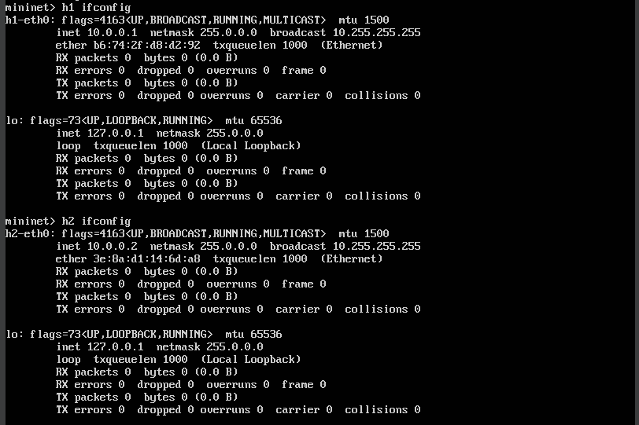
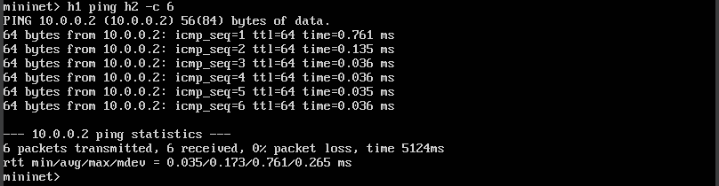
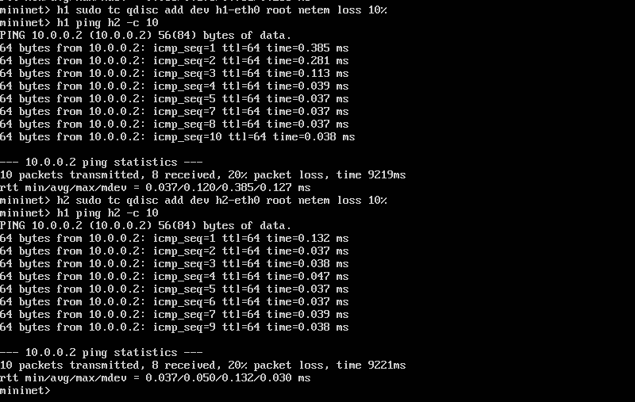
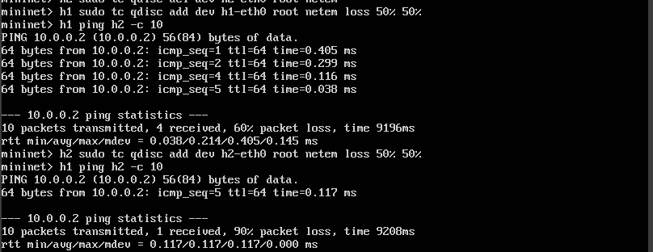
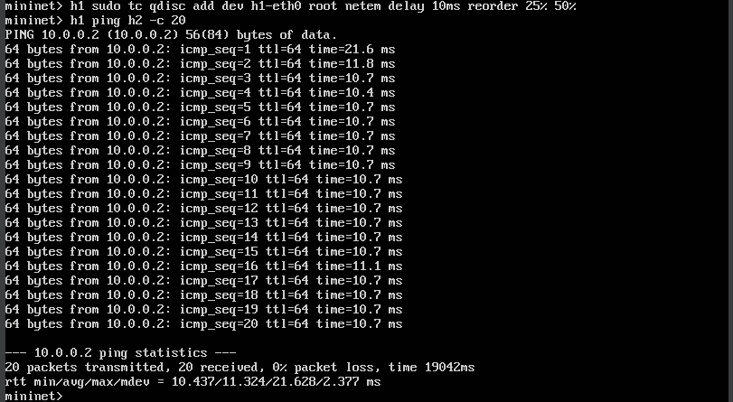
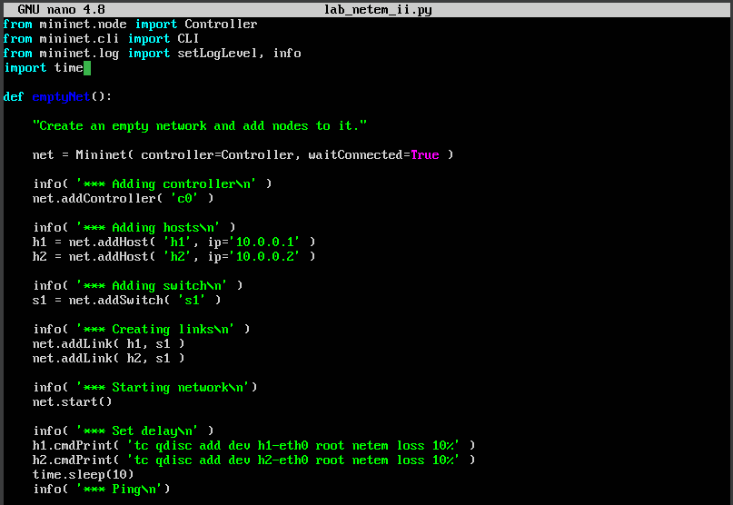
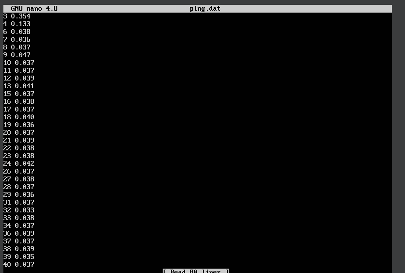
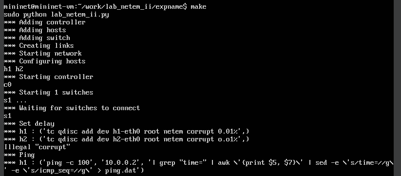
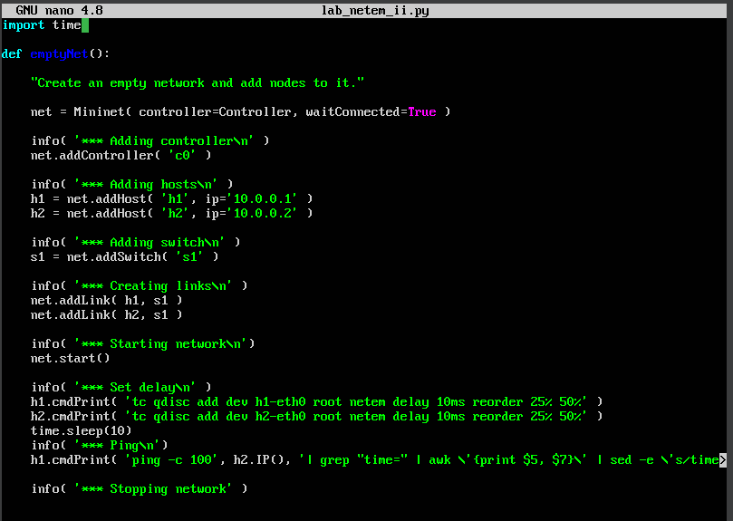
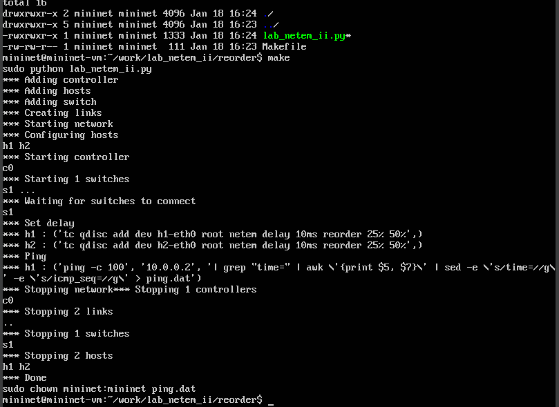

---
## Front matter
title: "Моделирование сетей передачи данных"
subtitle: "Отчёт по лабораторной работе №5: Эмуляция и измерение потерь пакетов в глобальных сетях"
author: "Ахлиддинзода Аслиддин"

## Generic otions
lang: ru-RU
toc-title: "Содержание"

## Bibliography
bibliography: bib/cite.bib
csl: pandoc/csl/gost-r-7-0-5-2008-numeric.csl

## Pdf output format
toc: true # Table of contents
toc-depth: 2
lof: true # List of figures
lot: true # List of tables
fontsize: 12pt
linestretch: 1.5
papersize: a4
documentclass: scrreprt
## I18n polyglossia
polyglossia-lang:
  name: russian
  options:
	- spelling=modern
	- babelshorthands=true
polyglossia-otherlangs:
  name: english
## I18n babel
babel-lang: russian
babel-otherlangs: english
## Fonts
mainfont: PT Serif
romanfont: PT Serif
sansfont: PT Sans
monofont: PT Mono
mainfontoptions: Ligatures=TeX
romanfontoptions: Ligatures=TeX
sansfontoptions: Ligatures=TeX,Scale=MatchLowercase
monofontoptions: Scale=MatchLowercase,Scale=0.9
## Biblatex
biblatex: true
biblio-style: "gost-numeric"
biblatexoptions:
  - parentracker=true
  - backend=biber
  - hyperref=auto
  - language=auto
  - autolang=other*
  - citestyle=gost-numeric
## Pandoc-crossref LaTeX customization
figureTitle: "Рис."
tableTitle: "Таблица"
listingTitle: "Листинг"
lolTitle: "Листинги"
## Misc options
indent: true
header-includes:
  - \usepackage{indentfirst}
  - \usepackage{float} # keep figures where there are in the text
  - \floatplacement{figure}{H} # keep figures where there are in the text
---
# Цель работы

Основной целью работы является получение навыков проведения интерактивных экспериментов в среде Mininet по исследованию параметров сети, связанных с потерей, дублированием, изменением порядка и повреждением пакетов при передаче данных. Эти параметры влияют на производительность протоколов и сетей.

# Выполнение лабораторной работы

1. На хостах h1 и h2 введём команду ifconfig, чтобы отобразить информацию, относящуюся к их сетевым интерфейсам и назначенным им IP-адресам. В дальнейшем при работе с NETEM и командой tc будут использоваться интерфейсы h1-eth0 и h2-eth0:

2. Проверим подключение между хостами h1 и h2 с помощью команды ping с параметром -c 6:

3.  Проверим, что соединение между хостом h1 и хостом h2 имеет больший процент потерянных данных (10% от хоста h1 к хосту h2 и 10% от хоста h2 к хосту h1), повторив команду ping с параметром -c 100 на терминале хоста h1:

4. Добавим на интерфейсе узла h1 коэффициент потери пакетов 50% (такой высокий уровень потери пакетов маловероятен), и каждая последующая вероятность зависит на 50% от последней:

5. Проверим, что на соединении от хоста h1 к хосту h2 имеются потери пакетов, используя команду ping с параметром -c 20 с хоста h1. Убедимся, что часть пакетов не будут иметь задержки (один из четырех, или 25%), а последующие несколько пакетов будут иметь задержку около 10 миллисекунд (трииз четырех, или 75%):

6. Проверим, что соединение от хоста h1 к хосту h2 имеются дубликаты пакетов:

{ #fig:006 width=100% height=100% }

7. Создадим скрипт для эксперимента lab_netem_ii.py с потерей 10%:

8. Открываем ping.dat и смотрим результаты:

9. Создаем Makefile как из прошлой лабораторной работы и запускаем:

10. Создадим скрипт для эксперимента lab_netem_ii.py с переотправкой:

11. Создаем для этого скрипта Makefile и запускаем:
{ #fig:011 width=100% height=100% }

# Вывод

В ходе выполнения лабораторной работы получили навыки проведения интерактивных экспериментов в среде Mininet по исследованию параметров сети, связанных с потерей, дублированием, изменением порядка и повреждением пакетов при передаче данных.

# Список литературы. Библиография

[1] Mininet: https://mininet.org/