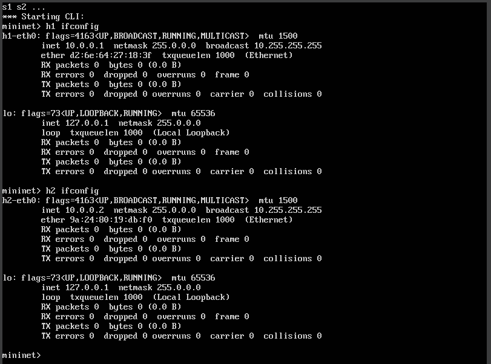
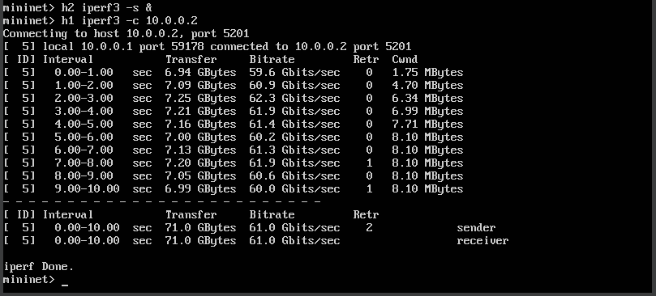
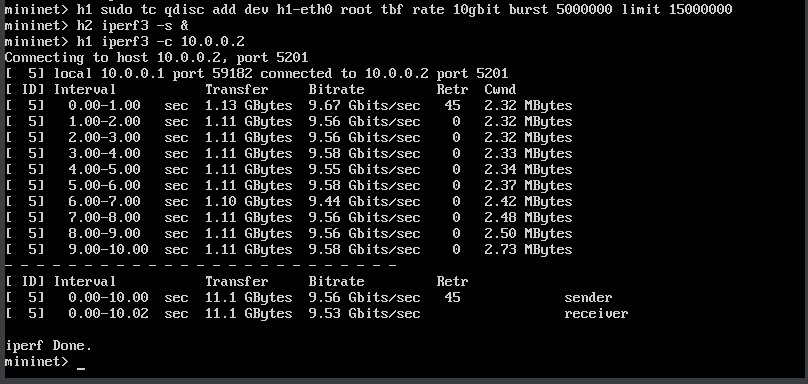
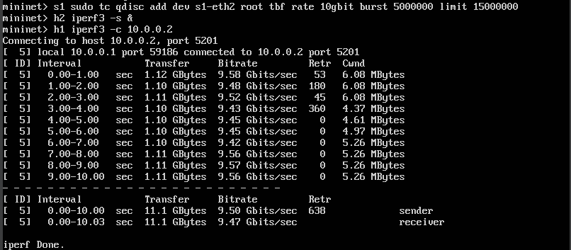
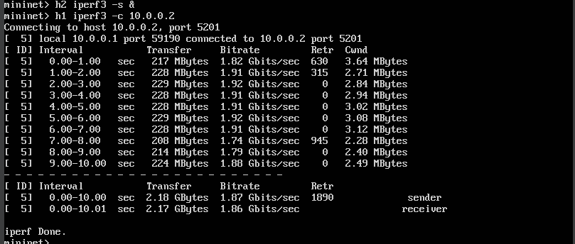

---
# Front matter
# Front matter
lang: ru-RU
title: "Моделирование сетей передачи данных"
subtitle: "Лабораторная работа №6: Настройка пропускной способности глобальной сети с помощью Token Bucket Filter"
author: "Ахлиддинзода Аслиддин"
institute:
  - Российский университет дружбы народов, Москва, Россия

# i18n babel
babel-lang: russian
babel-otherlangs: english

# Formatting pdf
toc: false
toc-title: Содержание
slide_level: 2
aspectratio: 169
section-titles: true
theme: metropolis
header-includes:
 - \metroset{progressbar=frametitle,sectionpage=progressbar,numbering=fraction}
 - '\makeatletter'
 - '\beamer@ignorenonframefalse'
 - '\makeatother'
---

# Цель работы

Основной целью работы является знакомство с принципами работы дисциплины очереди Token Bucket Filter, которая формирует входящий/исходящий трафик для ограничения пропускной способности, а также получение навыков моделирования и исследования поведения трафика посредством проведения интерактивного и воспроизводимого экспериментов в Mininet.

# Выполнение лабораторной работы

1. На хостах h1, h2 и на коммутаторах s1, s2 введём команду ifconfig, чтобы отобразить информацию, относящуюся к их сетевым интерфейсам и назначенным им IP-адресам. В дальнейшем при работе с NETEM и командой tc будем использовать интерфейсы h1-eth0, h2-eth0, s1-eth2:

2. В терминале хоста h2 запустим iPerf3 в режиме сервера и в терминале хоста h1 запустим iPerf3 в режиме клиента:

3. Фильтр tbf требует установки значения всплеска при ограничении скорости. Это значение должно быть достаточно высоким, чтобы обеспечить установленную скорость. Она должна быть не ниже указанной частоты, делённой на HZ, где HZ — тактовая частота, настроенная как параметр ядра, и может быть извлечена с помощью следующей команды:

4. Применим правило ограничения скорости tbf с параметрами rate = 10gbit, burst = 5,000,000, limit= 15,000,000 к интерфейсу s1-eth2 коммутатора s1, который соединяет его с коммутатором s2:

5. Объединим NETEM и TBF, введя на интерфейсе s1-eth2 коммутатора s1 задержку, джиттер, повреждение пакетов и указав скорость:

6. В терминале хоста h2 запустим iPerf3 в режиме сервера и в терминале хоста h1 запустим iPerf3 в режиме клиента:

# Вывод

В ходе выполнения лабораторной работы познакомились с принципами работы дисциплины очереди Token Bucket Filter, которая формирует входящий/исходящий трафик для ограничения пропускной способности, а также получили навыки моделирования и исследования поведения трафика посредством проведения интерактивного и воспроизводимого экспериментов в Mininet.

# Список литературы. Библиография

[1] Mininet: https://mininet.org/