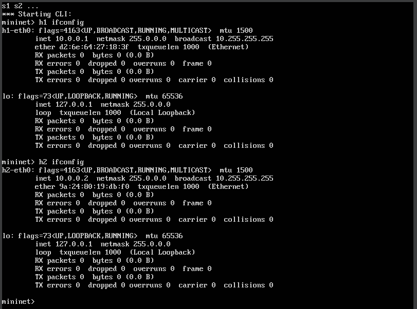
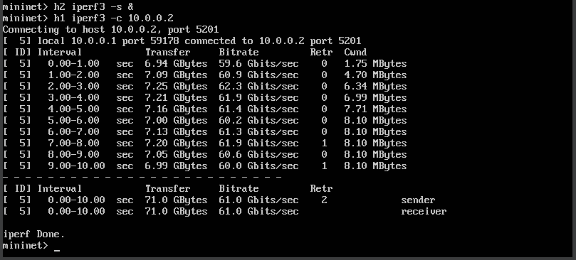
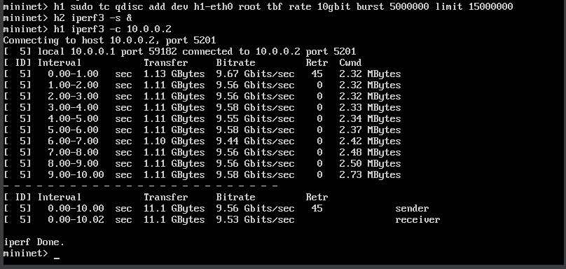
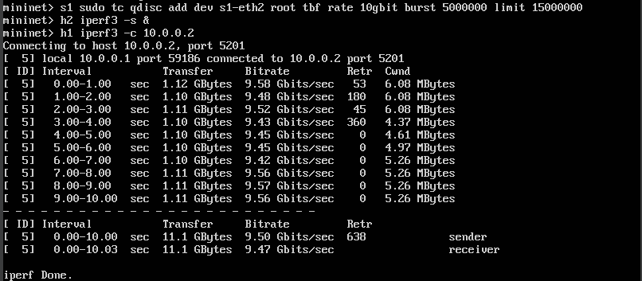
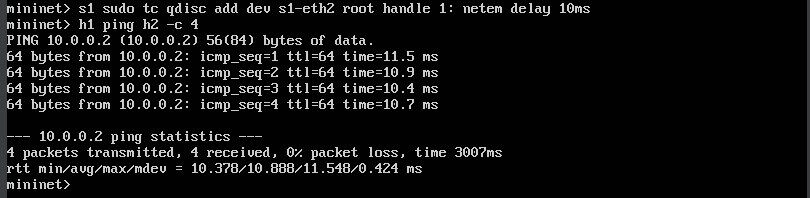
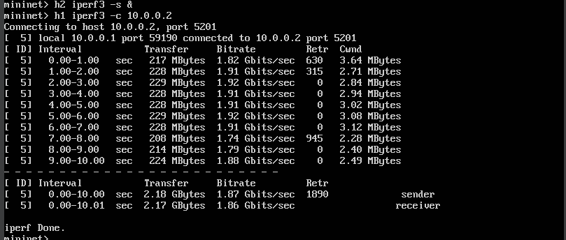

---
## Front matter
title: "Моделирование сетей передачи данных"
subtitle: "Отчёт по лабораторной работе №6: Настройка пропускной способности глобальной сети с помощью Token Bucket Filter"
author: "Ахлиддинзода Аслиддин"

## Generic otions
lang: ru-RU
toc-title: "Содержание"

## Bibliography
bibliography: bib/cite.bib
csl: pandoc/csl/gost-r-7-0-5-2008-numeric.csl

## Pdf output format
toc: true # Table of contents
toc-depth: 2
lof: true # List of figures
lot: true # List of tables
fontsize: 12pt
linestretch: 1.5
papersize: a4
documentclass: scrreprt
## I18n polyglossia
polyglossia-lang:
  name: russian
  options:
	- spelling=modern
	- babelshorthands=true
polyglossia-otherlangs:
  name: english
## I18n babel
babel-lang: russian
babel-otherlangs: english
## Fonts
mainfont: PT Serif
romanfont: PT Serif
sansfont: PT Sans
monofont: PT Mono
mainfontoptions: Ligatures=TeX
romanfontoptions: Ligatures=TeX
sansfontoptions: Ligatures=TeX,Scale=MatchLowercase
monofontoptions: Scale=MatchLowercase,Scale=0.9
## Biblatex
biblatex: true
biblio-style: "gost-numeric"
biblatexoptions:
  - parentracker=true
  - backend=biber
  - hyperref=auto
  - language=auto
  - autolang=other*
  - citestyle=gost-numeric
## Pandoc-crossref LaTeX customization
figureTitle: "Рис."
tableTitle: "Таблица"
listingTitle: "Листинг"
lolTitle: "Листинги"
## Misc options
indent: true
header-includes:
  - \usepackage{indentfirst}
  - \usepackage{float} # keep figures where there are in the text
  - \floatplacement{figure}{H} # keep figures where there are in the text
---
# Цель работы

Основной целью работы является знакомство с принципами работы дисциплины очереди Token Bucket Filter, которая формирует входящий/исходящий трафик для ограничения пропускной способности, а также получение навыков моделирования и исследования поведения трафика посредством проведения интерактивного и воспроизводимого экспериментов в Mininet.

# Выполнение лабораторной работы

1. На хостах h1, h2 и на коммутаторах s1, s2 введём команду ifconfig, чтобы отобразить информацию, относящуюся к их сетевым интерфейсам и назначенным им IP-адресам. В дальнейшем при работе с NETEM и командой tc будем использовать интерфейсы h1-eth0, h2-eth0, s1-eth2:

2. В терминале хоста h2 запустим iPerf3 в режиме сервера и в терминале хоста h1 запустим iPerf3 в режиме клиента:

3. Фильтр tbf требует установки значения всплеска при ограничении скорости. Это значение должно быть достаточно высоким, чтобы обеспечить установленную скорость. Она должна быть не ниже указанной частоты, делённой на HZ, где HZ — тактовая частота, настроенная как параметр ядра, и может быть извлечена с помощью следующей команды:

4. Применим правило ограничения скорости tbf с параметрами rate = 10gbit, burst = 5,000,000, limit= 15,000,000 к интерфейсу s1-eth2 коммутатора s1, который соединяет его с коммутатором s2:

5. Объединим NETEM и TBF, введя на интерфейсе s1-eth2 коммутатора s1 задержку, джиттер, повреждение пакетов и указав скорость:

6. В терминале хоста h2 запустим iPerf3 в режиме сервера и в терминале хоста h1 запустим iPerf3 в режиме клиента:

# Вывод

В ходе выполнения лабораторной работы познакомились с принципами работы дисциплины очереди Token Bucket Filter, которая формирует входящий/исходящий трафик для ограничения пропускной способности, а также получили навыки моделирования и исследования поведения трафика посредством проведения интерактивного и воспроизводимого экспериментов в Mininet.

# Список литературы. Библиография

[1] Mininet: https://mininet.org/